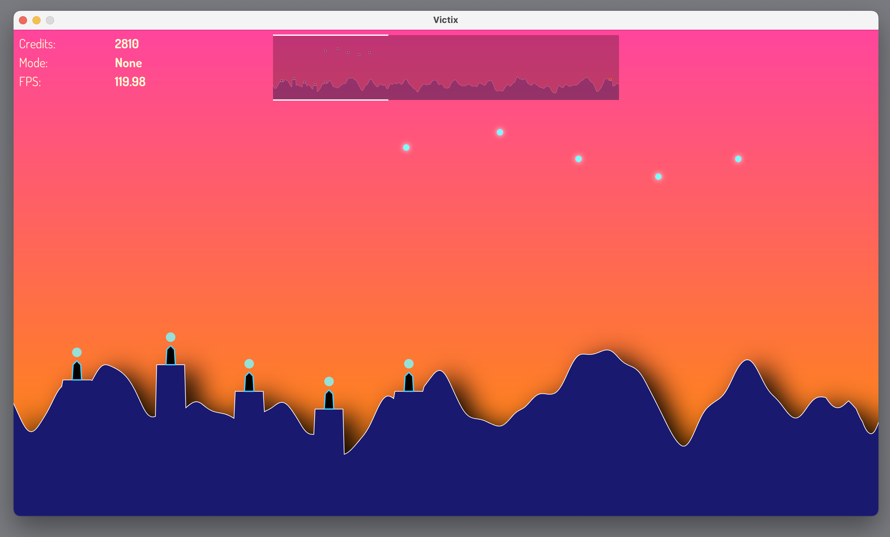

Some experimentation around fast 2D vector drawing frameworks. I decided on Skia to be the most performant, but it can be difficult to get built.

Written in C++ using CMake for building and vcpkg for installing packages. Built on CLion. 

